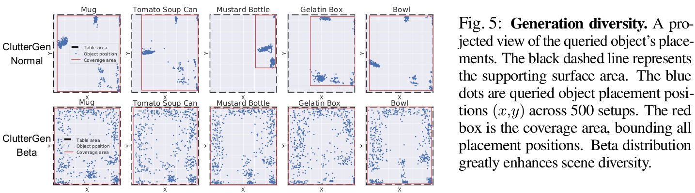

# ClutterGen: A Cluttered Scene Generator for Robot Learning
<a href="https://yjia.net/">Yinsen Jia</a>, <a href="http://boyuanchen.com/">Boyuan Chen</a> <br>
_Duke University_ <br>

<span style="font-size:17px; display: block; text-align: left;">
    <a href=http://generalroboticslab.com/ClutterGen target="_blank" style="text-decoration: underline;">[Project Page]</a> 
    <a href=https://www.youtube.com/watch?v=ZD6JslZgAfQ target="_blank" style="text-decoration: underline;">[Video]</a>
    <a href=https://arxiv.org/abs/2407.05425 target="_blank" style="text-decoration: underline;">[arXiv]</a> <br>
</span>


### Abstract
ClutterGen, a physically compliant simulation scene generator capable of producing highly diverse, cluttered, and stable scenes for robot learning. Generating such scenes is challenging as each object must adhere to physical laws like gravity and collision. As the number of objects increases, finding valid poses becomes more difficult, necessitating significant human engineering effort, which limits the diversity of the scenes. To overcome these challenges, we propose a reinforcement learning method that can be trained with physics-based reward signals provided by the simulator. Our experiments demonstrate that ClutterGen can generate cluttered object layouts with up to ten objects on confined table surfaces. Additionally, our policy design explicitly encourages the diversity of the generated scenes for open-ended generation. Our real-world robot results show that ClutterGen can be directly used for clutter rearrangement and stable placement policy training.

<p align="center">
     <br>
    <em>(a/b) When the number of objects in the environment increases, the difficulty of creating such a stable setup also increases. The traditional heuristic method cannot create a simulation scene above 7 objects, while ClutterGen consistently achieves high success rates. (c) Diverse, cluttered, and stable simulation setups created by ClutterGen.</em>
</p>

## Content
<!-- <span style="font-size:17px; display: block; text-align: center;">
    <a href="#prerequisites">Prerequisites</a> <br>
    <a href="#training">Training</a> <br>
    <a href="#evaluation">Evaluation</a> <br>
    <a href="#real-robot-applications">Real-robot</a> <br>
    <a href="#bibTex">BibTex</a> <br>
</span> -->

<ul style="font-size:17px;">
  <li><a href="#prerequisites">Prerequisites</a></li>
  <li><a href="#training">Training</a></li>
  <li><a href="#evaluation">Evaluation</a></li>
  <li><a href="#real-robot-applications">Real-robot</a></li>
  <li><a href="#bibTex">BibTex</a></li>
</ul>

## Prerequisites
Please clone the repository first, (Link needs to be changed)
```sh
git clone https://github.com/generalroboticslab/ClutterGen.git
cd ClutterGen
git checkout main
```

We use [`conda`](hhttps://docs.anaconda.com/miniconda/) to create a virtual environment with python3.9 and other requried packages.
```sh
conda create --name ClutterGen python=3.9
```

Activate the environment and install the required packages,
```sh
conda activate ClutterGen
pip install -r requirements.txt --no-cache-dir
```

## Training

To train full _ClutterGen_ model, run the following command:

We use the `wandb` package to log the training stats, which will ask you to log in the account if you specify `--collect_data`. You can create a free account on [wandb](https://wandb.ai). <br>

```sh
python ppo_scene_generation.py \
--collect_data \
--result_dir train_res \
--num_envs 16 \
--asset_root 'assets' \
--object_pool_folder 'group_objects/group0_dinning_table'

# --collect_data: Save training results and log the training stats to wandb.
# --result_dir: The directory to save the training results.
# --num_envs: The number of parallel environments to train (reduce if you run out of GPU memory).
# --asset_root: The root directory of the object assets.
# --object_pool_folder: The folder name of the object pool. We provide several object pools in the `assets/group_objects` folder.
```

### Baselines
**Random Rejection Sampling (RRS).** This method heuristically computes the position of the supporting surface in the queried scene and randomly places objects within the queried region. RRS does not need to be trained. Please check the [Evaluation](#Evaluation) section for the evaluation command of this method. <br> 

**ClutterGen-OpenLoop (OL).** This method uses the same architecture as ClutterGen, but without previous object movement trajectory and placement pose information (including the reward) for the next attempt. <br>
```sh
python ppo_scene_generation.py \
--collect_data \
--result_dir train_res \
--num_envs 16 \
--asset_root 'assets' \
--object_pool_folder 'group_objects/group0_dinning_table'
--open_loop
```

**ClutterGen-ShortMemory (SM).** This method uses the same architecture but only takes the latest attempt history (buffer length = 1) for the next attempt. <br>
```sh
python ppo_scene_generation.py \
--collect_data \
--result_dir train_res \
--num_envs 16 \
--asset_root 'assets' \
--object_pool_folder 'group_objects/group0_dinning_table'
--short_memory
```

**ClutterGen-Normal.** This method uses the truncated normal distribution instead of the beta distribution for the object placement policy. <br>
To keep the code clean and independent, we implement this method in another branch. First, you need to checkout the branch,
```sh
git checkout cluttergen_normal
```
Then, you can run the following command to train the model,
```sh
python ppo_scene_generation.py \
--collect_data \
--result_dir train_res \
--num_envs 16 \
--asset_root 'assets' \
--object_pool_folder 'group_objects/group0_dinning_table'
```

_Note_: If you want to watch the training process, you can add `--rendering` and `--realtime` to the command. However, it will slow down the training process and increase the memory usage. <br>

We also provide `--seed` to set the random seed for the training. <br>

## Evaluation
After the training is done, your checkpoint will be saved in the `/[--result_dir]/Union/checkpoint` and the training description file will be saved in the `/[--result_dir]/Union/Json`. By default, `[--result_dir]` is `train_res`. <br>

Each checkpoint is saved with the following format, `[CHECKPOINT NAME]_[EPISODE]`. For example, in `Union_2024_05_17_154159_Sync_Beta_group1_studying_table_table_PCExtractor_Rand_ObjPlace_Goal_maxObjNum10_maxPool10_maxScene1_maxStab40_contStab20_Epis2Replaceinf_Weight_rewardPobj100.0_seq5_step80_trial3_entropy0.01_seed123456_best`, the checkpoint name is `Union_2024_05_17_154159_Sync_Beta_group1_studying_table_table_PCExtractor_Rand_ObjPlace_Goal_maxObjNum10_maxPool10_maxScene1_maxStab40_contStab20_Epis2Replaceinf_Weight_rewardPobj100.0_seq5_step80_trial3_entropy0.01_seed123456` and the episode name is `best`. <br>

We have provided a script to evaluate the saved model checkpoints `evaluation_sg.py`. All evaluation results will be stored in `/eval_res` if `--collect_data` is specified during evaluation.  

The evaluations of _ClutterGen_, _ClutterGen-OL_, _ClutterGen-SM_ can be run by following commands, <br>
```sh
python evaluation_sg.py \
--collect_data \
--num_envs 1 \
--num_trials 1000 \
--checkpoint [CHECKPOINT NAME] \
--index_episode [CHECKPOINT EPISODE] \
--max_num_placing_objs_lst "[10]"

# --num_trials: The number of trials (episodes) to evaluate the model.
# --checkpoint: The folder name of the checkpoint to evaluate, which is saved in the `train_res/Union` directory. E.g. "Union_2024_05_17_154159_Sync_Beta_group1_studying_table_table_PCExtractor_Rand_ObjPlace_Goal_maxObjNum10_maxPool10_maxScene1_maxStab40_contStab20_Epis2Replaceinf_Weight_rewardPobj100.0_seq5_step80_trial3_entropy0.01_seed123456" is the checkpoint name.
# --index_episode: The episode of the checkpoint to evaluate. If you want to evaluate the best success rate checkpoint, you can set it to `best`.
# --max_num_placing_objs_lst: The maximum number of objects to place in the scene. You can specify multiple numbers in the list, e.g., "[0, 5, 10]". Each number will be evaluated separately for [--num_trials] episodes.
```

The evaluations of _ClutterGen-Normal_ can be run by following commands, <br>
First, you need to checkout the branch,

```sh
git checkout cluttergen_normal
```

Then, you can run the following command to evaluate the model,
```sh
python evaluation_sg.py \
--collect_data \
--num_envs 1 \
--num_trials 1000 \
--checkpoint [CHECKPOINT NAME] \
--index_episode [CHECKPOINT EPISODE] \
--max_num_placing_objs_lst "[10]"
```

The evaluations of _RRS_ can be run by following commands, <br>
```sh
python evaluation_sg.py \
--collect_data \
--num_envs 1 \
--num_trials 1000 \
--heuristic_policy \
--checkpoint [CHECKPOINT NAME] \
--max_num_placing_objs_lst "[10]"

# Here, --checkpoint is used to specify the environment configuration. 
```

_Note_: If you want to watch the evaluation process, you can add `--rendering` and `--realtime` to the command. However, it will slow down the evaluation process and increase the memory usage. <br>

### Visualization for Evaluation
After evaluations with `--collect_data`, the evaluation results will be saved in `/eval_res`. We provide visualization script to visualize the result. <br>

To plot the success rate curve, run the following command, <br>
```sh
python plot_utils.py \
--task SuccessRate \
--evalUniName [EVALUATION NAME] \
--RRSName [RRS EVALUATION NAME] \

# --evalUniName: The name of the evaluation result folder, which is saved in the `eval_res/Union/trajectories` directory after evaluation.
# --RRSName: The name of the RRS evaluation result folder.
```
The plot will be saved to `results/success_summary.pdf`.
<p align="center">
     <br>
    <em>The success rate comparision between ClutterGen and RRS.</em>
</p>


To plot the diversity map and the stable steps of the evaluation, run the following command, <br>
```sh
python plot_utils.py \
--task MiscInfo \
--evalUniName [EVALUATION NAME] \
```
The plots will be saved to `eval_res/Union/trajectories/[--evalUniName]`.
<p align="center">
     <br>
    <!--  <br> -->
</p>


### Scene-level Generalization
After training, ClutterGen can be directly applied to generate cluttered scenes by varing the queried region and the initial queried scene. 

To vary the queried region, you can run evaluation with following command, <br>
```sh
python evaluation_sg.py \
--collect_data \
--num_envs 1 \
--num_trials 1000 \
--checkpoint [CHECKPOINT NAME] \
--index_episode [CHECKPOINT EPISODE] \
--max_num_placing_objs_lst "[10]" \
--random_qr_pos \
--random_qr_rotz \
--random_srk_qr_halfext \
--random_exp_qr_halfext \
--new_tablehalfExtents "[0.7, 0.7, 0.35]"

# --random_qr_pos: Randomize the queried region position.
# --random_qr_rotz: Randomize the queried region rotation.
# --random_srk_qr_halfext: Randomize the queried region half-extent by shrinkage.
# --random_exp_qr_halfext: Randomize the queried region half-extent by expansion.
# --new_tablehalfExtents: The new initial queried scene half-extents in the format of [x, y, z]. 
# All randomization parameters can be found in the paper. Please make sure the queried region is within the table surface.
```

You can also specify the queried region to certain poses for desired scene generation. <br>
```sh
python evaluation_sg.py \
--collect_data \
--num_envs 1 \
--num_trials 1000 \
--checkpoint [CHECKPOINT NAME] \
--index_episode [CHECKPOINT EPISODE] \
--max_num_placing_objs_lst "[10]" \
--QueryRegion_pos "[0.1, 0.1, 0.]" \
--QueryRegion_euler_z 0.5 \
--QueryRegion_halfExtents "[0.25, 0.25, 0.35]"

# --QueryRegion_pos: The new queried region position in the world frame (m).
# --QueryRegion_euler_z: The new queried region rotation in the z-axis (rad).
# --QueryRegion_halfExtents: The new queried region half-extents (m).
```

To vary the initial queried scene (E.g. generate scene on other tables), you can run evaluation with following command, <br>
```sh
python evaluation_sg.py \
--collect_data \
--num_envs 1 \
--num_trials 1000 \
--checkpoint [CHECKPOINT NAME] \
--index_episode [CHECKPOINT EPISODE] \
--max_num_placing_objs_lst "[10]" \
--specific_scene "table_N"

# --specific_scene: The name of the specific scene to generate which is formulated by [table]_[index]. The scene index can be found in the `assets/tabletop_selected_scene/table` folder.
```
<p align="center">
     <br>
    <em>ClutterGen generates diverse setups for various queried scene</em>
</p>

## Real Robot Applications
We use the Franka Panda robotic arm and the RealSense RGB-D camera for Clutter Rearrangement and Stable Object Placement tasks. We use the [GroundDINO](https://github.com/IDEA-Research/GroundingDINO)+[SAM](https://github.com/facebookresearch/segment-anything)+[FoundationPose](https://github.com/NVlabs/FoundationPose) for objects detection and pose esitionmation. The [MoveIt](https://github.com/moveit/moveit) package is used for the panda arm control. We also provide the CAD models for the panda arm with the default gripper.

### Franka Panda Setup and Camera Calibration
First, please follow the [Franka Panda setup](https://frankaemika.github.io/docs/installation_linux.html) and [RealSense camera setup](https://github.com/IntelRealSense/librealsense/blob/master/doc/distribution_linux.md) to install the required packages. After that, you can follow the [Calibration_instructions](robot_related/assets/cam_calibration.pdf) to calibrate the camera and the panda arm. We consider the panda base frame as the world frame.


### Clutter Rearrangement 
First, please check our [video](#) to see the pipeline of the clutter rearrangement task. <br>

To run the clutter rearrangement task, you can run the following command, <br>
```sh
python pick_and_place.py \
--task rearrangement \
--camera_extrinsics_path [CAMERA EXTRINSICS PATH] \
--panda2crop_center_path [PANDA2CROP CENTER PATH] \
--sg_checkpoint [CLUTTERGEN CHECKPOINT] \
--sg_index_episode [CLUTTERGEN EPISODE]

# --task The task to run. We provide `rearrangement` and `stable_placement`.
# --camera_extrinsics_path The path of the camera extrinsics file.
# --panda2crop_center_path The path of the panda2crop center file. This is used to crop the points cloud within certain region.
# --sg_checkpoint The checkpoint of the ClutterGen model.
# --sg_index_episode The episode of the ClutterGen checkpoint.
```

### Object Stable Placement
First, please check our [video](#) to see the pipeline of the stable object placement task. <br>

We need to collect stable placement data using ClutterGen before training the stable placement policy. You can run the following command to collect the data, <br>
```sh
python evaluation_sg.py \
--collect_data \
--num_envs 1 \
--num_success_trials 500 \
--checkpoint [CHECKPOINT NAME] \
--index_episode [CHECKPOINT EPISODE] \
--max_num_placing_objs_lst "[10]" \
--sp_data_collection \
--strict_checking

# --num_success_trials: The number of successful episodes to collect the stable placement data. Each episode we collect 10 data points.
# --sp_data_collection: Collect the stable placement data.
# --strict_checking: Re-check the stability of all objects for each successfule episode.
```
Please use the checkpoint trained with Real Group objects. The stable placement data will be saved in the `StablePlacement/SP_Dataset` directory. <br>

To split the data into training, validation, and test sets, you can run the following command, <br>
```sh
python StablePlacement/sp_dataloader.py
```
The data will be saved in the `StablePlacement/SP_Dataset` directory. <br>

To train the stable placement policy, you can run the following command, <br>
```sh
python StablePlacement/train.py \
--collect_data \
--epochs 1000 \
--batch_size 40 \
--use_simulator \
--evalUniName [EVALUATION NAME] \

# --epochs: The number of epochs to train the policy.
# --batch_size: The batch size for training.
# --use_simulator: Use the simulator to evaluate the policy.
# --evalUniName: The name of the checkpoint that used for stableplacement data collection.
```

To run the stable object placement task, you can run the following command, <br>
```sh
python pick_and_place.py \
--task stable_placement \
--camera_extrinsics_path [CAMERA EXTRINSICS PATH] \
--panda2crop_center_path [PANDA2CROP CENTER PATH] \
--sp_checkpoint [STABLE PLACEMENT CHECKPOINT] \
--sp_index_episode [STABLE PLACEMENT EPISODE]
```


## BibTeX

If you find this repo useful, please consider citing,
```
@misc{jia2024cluttergenclutteredscenegenerator,
      title={ClutterGen: A Cluttered Scene Generator for Robot Learning}, 
      author={Yinsen Jia and Boyuan Chen},
      year={2024},
      eprint={2407.05425},
      archivePrefix={arXiv},
      primaryClass={cs.RO},
      url={https://arxiv.org/abs/2407.05425}, 
}
```